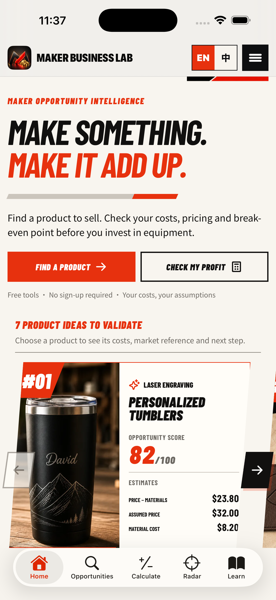

# Maker Business Lab App UX Audit — 2026-09-24

## Scope

Reviewed the live-content iOS shell on the available iPhone simulator. The flow covers Home, Chinese Radar, H5 freshness, loading/error behavior, native navigation, and the updated app mark.

## 1. Baseline Home

**Health before changes: needs improvement.** The first-party H5 content rendered correctly and the primary paths were clear. The native header was taller than necessary, the tab bar could cover the end of long pages, and a failed background refresh would replace usable content with a large blocking error card.

## 2. Optimized Home

**Health after changes: good.** The native header uses less vertical space, the brighter red-and-gold mark remains legible at header size, and the H5 content receives enough bottom inset to scroll clear of the tab bar. The app now supports pull-to-refresh and a thin progress indicator when revalidating an already visible page.

## 3. Optimized Chinese Radar

**Health after changes: good.** Chinese locale switching, the weekly-product/daily-validation hierarchy, CTA order, imagery, and native tab selection render correctly. The native header remains consistent across languages.

## 4. Small iPhone Home

**Health after changes: good.** The header, primary CTAs, content hierarchy, and tab bar remain usable at 375 × 667 points. The English tab labels were shortened to **Ideas** and **Profit** after this check to improve spacing further.

## Highest-impact changes

1. Revalidate live H5 content on launch, tab activation, foreground return, and manual pull-to-refresh.
2. Keep the last rendered page visible when a refresh fails and show a compact retry banner.
3. Add bottom safe space so the native tab bar does not cover H5 content.
4. Reduce native header height and add selection feedback for tab and language changes.
5. Replace the dark mark with a brighter red-and-gold profit mark and align App Store notes with the current architecture.

## Evidence limits

Screenshots confirm visible layout, language switching, and simulator rendering. VoiceOver reading order, real-device haptics, poor-network timing, and App Store review behavior still require device or external-system checks.
